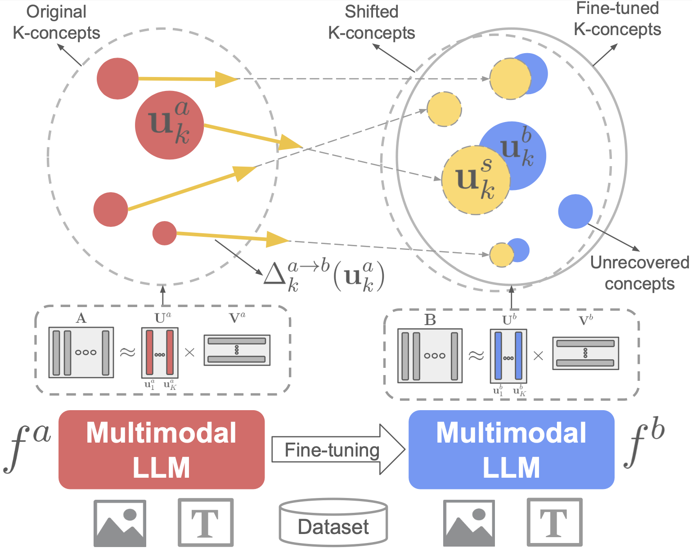
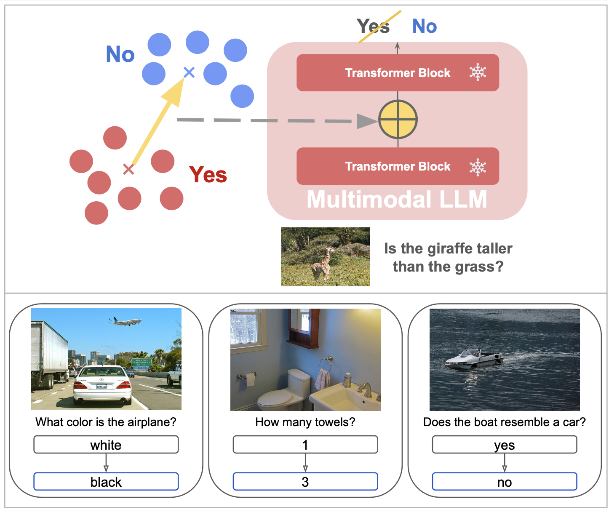

# XL-VLMs: General Repository for eXplainable Large Vision Language Models

This repository contains explainability tools for the internal representations of large vision language models and steering  functionalities for VQA and captioning tasks across various models.


# News

* **[2024.10.30]**: XL-VLMs repo is public.
* **[2024.09.25]**: Our paper **A Concept based Explainability Framework for Large Multimodal Models** <a href="https://arxiv.org/abs/2406.08074">
    
  </a> </a>
  <a href="https://jayneelparekh.github.io/LMM_Concept_Explainability/">
    
  </a> is accepted in NeurIPS 2024.
* **[2025.01.02]**: Our paper [Analyzing Fine-tuning Representation Shift for Multimodal LLMs Steering](https://arxiv.org/abs/2406.08074) is on arxiv.


# Supported methods

We support the approaches introduced in the following papers:

* [CoX-LMM: A Concept based Explainability Framework for Large Multimodal Models](https://arxiv.org/abs/2406.08074)

* [Analyzing Fine-tuning Representation Shift for Multimodal LLMs Steering](https://arxiv.org/abs/2406.08074)


<br> <br>


## Analyzing Fine-tuning Representation Shift for Multimodal LLMs Steering

  > Multimodal LLMs have reached remarkable levels of proficiency in understanding multimodal inputs, driving extensive research to develop increasingly powerful models. However, much less attention has been paid to understanding and explaining the underlying mechanisms of these models. Most existing explainability research examines these models only in their final states, overlooking the dynamic representational shifts that occur during training. In our previous work ([CoX-LMM: A Concept based Explainability Framework for Large Multimodal Models](https://arxiv.org/abs/2406.08074)) we proposed a dictionary learning based approach, applied to the representation of tokens where the elements of the learned dictionary correspond to our proposed concepts, semantically grounded in both vision and text.


  <p align="center">
        <br>  <br>
  </p>

  > In this work, we systematically analyze the evolution of hidden state representations to reveal how fine-tuning alters the internal structure of a model to specialize in new multimodal tasks. Using a concept-based approach, we map hidden states to interpretable visual and textual concepts, enabling us to trace changes in encoded concepts across modalities as training progresses. We also demonstrate the use of shift vectors to capture these concepts changes. These shift vectors allow us to recover fine-tuned concepts by shifting those in the original model.

  <p align="center">
        <br>  <br>
  </p>

  > Finally, we explore the practical impact of our findings on model steering, showing that we can adjust multimodal LLMs behaviors without any training, such as modifying answer types, captions style, or biasing the model toward specific responses. Our work sheds light on how multimodal representations evolve through fine-tuning and offers a new perspective for interpreting model adaptation in multimodal tasks. The code will be made publicly available.


  <br> <br>

# Installation

Please refer to [docs/installation.md](docs/installation.md) for installation instructions

# Usage

## Models

We support models from the `transformers` library. Currently we support the following:
* **llava-v1.5-7b**
* **idefics2-8b**
* **Molmo-7B-D-0924**
* **Qwen2-VL-7B-Instruct**

## How to work with this repo


A high-level workflow while working with the repo could consist of three different parts :


### 1. **Discovering Multimodal Concepts** 🌌  
   - 🚀 Extracting hidden states from the multimodal LLM.  
   - 🧩 Aggregating extracted hidden states across target samples; let's call this aggregation `Z`.  
   - 🔍 Decomposing `Z` into concept vectors and activations, using a decomposition strategy such as semi-NMF, k-means, etc.: `Z = U V`.  
   - 🖼️ Grounding the concepts (columns of `U`) in text and image.  

   👉 Check out [src/examples/concept_dictionary](src/examples/concept_dictionary) for commands related to this part (described in our previous work [CoX-LMM: A Concept-based Explainability Framework for Large Multimodal Models](https://arxiv.org/abs/2406.08074)).  

---

### 2. **Computing Shift Vectors** 🔄  
   - 📊 Computing concepts from the original and destination models.  
   - 🧠 Associating each sample with the concept it activates the most.  
   - ✨ Computing the shift in the representation of samples associated with each concept and obtaining a shift vector.  
   - 🔧 Applying the shift on the concepts of the original model, and comparing the result with concepts of the destination model.  

   👉 Check out [src/examples/shift_analysis/concept_dictionary_evaluation.sh](src/examples/shift_analysis/concept_dictionary_evaluation.sh) for commands related to this part (and visualization of this analysis can be found in [Playground/shift_analysis.ipynb](Playground/shift_analysis.ipynb)).  

   🧪 You can test this feature by providing your own hidden state representations, which should be structured in a file as described in [docs/saved_feature_structure.md](docs/saved_feature_structure.md).  

---

### 3. **Steering the Model** 🎛️  
   - ⚙️ Computing steering vectors from the hidden representations of two sets of samples; one set is associated with what is going to be steered (e.g., a particular answer in VQA to be changed, or random if all answers are to be shifted), and the other set is associated with the target of steering (e.g., a particular answer in VQA, or captions related to a particular concept, such as color or sentiment).  
   - 🎯 Applying this steering vector on validation samples, and evaluating the steering (e.g., how targeted is steering? How is the accuracy of different answers affected? How is the quality of generated captions?).  

   👉 Check out [src/examples/model_steering](src/examples/model_steering) for commands related to steering the model for different tasks and its evaluation.

# Contributing
We welcome contributions to this repo. It could be in form of support for other models, datasets, or other analysis/interpretation methods for multimodal models. However, contributions should only be made via pull requests. Please refer to rules given at ```docs/contributing.md```


## Citation

```bibtex
@article{parekh2024concept,
  title={A Concept-Based Explainability Framework for Large Multimodal Models},
  author={Parekh, Jayneel and Khayatan, Pegah and Shukor, Mustafa and Newson, Alasdair and Cord, Matthieu},
  journal={arXiv preprint arXiv:2406.08074},
  year={2024}
}
```
