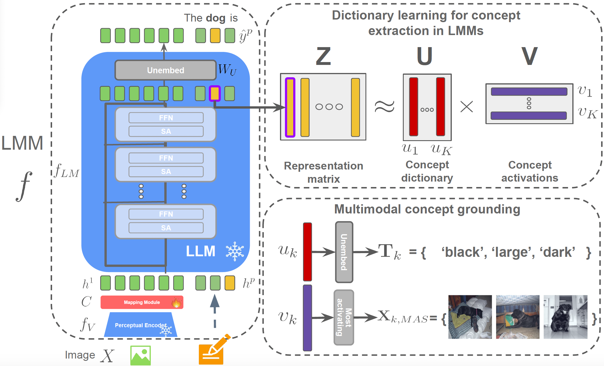

# XL-VLMs: General Repository for eXplainable Large Vision Language Models

This repository implements tools to explain internal representations of large vision language models. It is currently built to support models from transformers library. Details about installation and usage are provided below.

To initiate this project we provide implementation of our NeurIPS 2024 paper [A Concept based Explainability Framework for Large Multimodal Models](https://arxiv.org/abs/2406.08074). Further details for the implemented methods can be found here

# News

* **[2024.11.05]**: XL-VLMs repo is public.
* **[2024.09.25]**: Our paper [A Concept based Explainability Framework for Large Multimodal Models](https://arxiv.org/abs/2406.08074) is accepted in NeurIPS 2024.
<br> <br>


# CoX-LMM (A Concept based Explainability Framework for Large Multimodal Models)
  ### [Paper](https://arxiv.org/abs/2406.08074) | [Project page](https://jayneelparekh.github.io/LMM_Concept_Explainability/)

  <p align="center">
        <br>  <br>
  </p>

  > Large multimodal models (LMMs) combine unimodal encoders and large language models (LLMs) to perform multimodal tasks. Despite recent advancements towards the interpretability of these models, understanding internal representations of LMMs remains largely a mystery. In this paper, we present a novel framework for the interpretation of LMMs. We propose a dictionary learning based approach, applied to the representation of tokens. The elements of the learned dictionary correspond to our proposed concepts. We show that these concepts are well semantically grounded in both vision and text. Thus we refer to these as "multi-modal concepts". We qualitatively and quantitatively evaluate the results of the learnt concepts. We show that the extracted multimodal concepts are useful to interpret representations of test samples. Finally, we evaluate the disentanglement between different concepts and the quality of grounding concepts visually and textually.

  <br> <br>

# Installation

Please refer to ```docs/installation.md``` for installation instructions

# Usage


## Datasets
We support the following datasets:
* COCO

## Models

We support models from the `transformers` library. Currently we support the following:
* LLaVA-1.5

## How to work with this repo
Please checkout ```save_features.sh```, ```feature_decomposition.sh```, ```concept_dictionary_evaluation.sh``` in ```src/examples```
for more details about different commands to execute various files.

A high-level workflow while working with the repo could consist of three different steps.

* **Saving hidden states**: Store hidden states for a model for a particular token of interest ('Dog', 'Cat', 'Train' etc.) from any layer via ```src/save_features.py```. We also have other options/functionalities to save hidden states from various parts. Please see ```src/examples/save_features.sh``` for further details.

* **Multimodal concept extraction**: Perform dictionary learning on stored hidden states to obtain your concept dictionary and extract information about visual/text grounding via ```src/analyse_features.py```. See ```src/examples/feature_decomposition.sh``` for details. You can visualize the multimodal concepts from your saved results as illustrated in ```playground/concept_grounding_visualization.ipynb```

* **Evaluation**: Compute the CLIPScore/Overlap metrics to evaluate your concept dictionary and its use to understand test samples via ```src/analyse_features.py```. Please refer to ```src/examples/concept_dictionary_evaluation.sh``` for details. 


# Contributing
We welcome contributions to this repo. It could be in form of support for other models, datasets, or other analysis/interpretation methods for multimodal models. However, contributions should only be made via pull requests. Please refer to rules given at ```docs/contributing.md```


# Citation
If you find this repository useful please cite the following paper
```
@article{parekh2024concept,
  title={A Concept-Based Explainability Framework for Large Multimodal Models},
  author={Parekh, Jayneel and Khayatan, Pegah and Shukor, Mustafa and Newson, Alasdair and Cord, Matthieu},
  journal={Advances in Neural Information Processing Systems},
  volume={37},
  year={2024}
}
```
